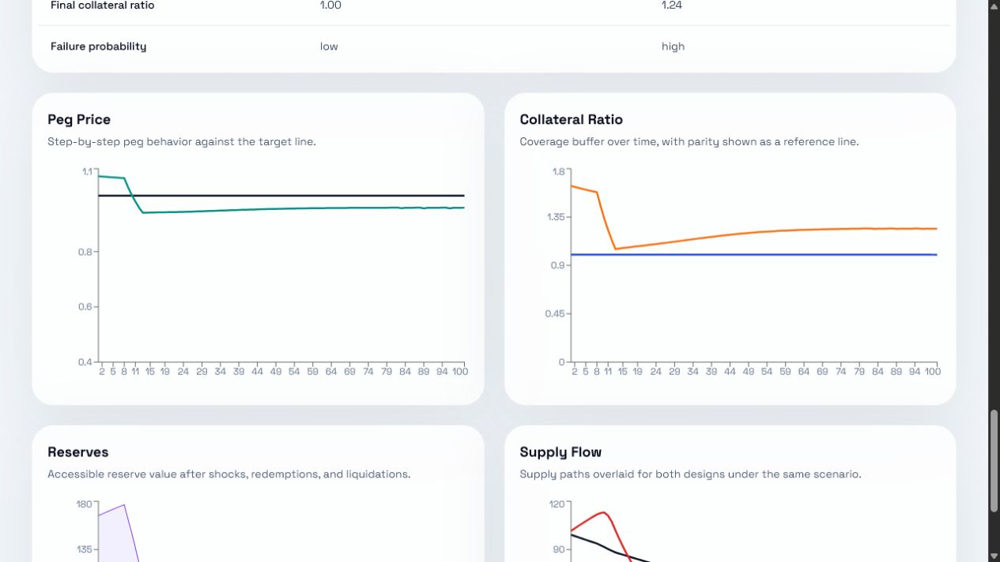

# PegLab

Design, stress-test, and compare stable asset architectures before deployment.



## Problem

Stable asset teams need a quick way to pressure-test design choices before building production systems. PegLab provides a bounded, explicit simulation surface for redemption stress, collateral shocks, oracle lag, and other fixed adverse scenarios.

## What it does

- Design a stable asset with one of three collateral models: fiat-backed, crypto-backed, or overcollateralized.
- Run the design against ten fixed stress tests with explicit scenario parameters.
- Compare two designs side by side with consistent metrics and shared charts.

## Quickstart

```bash
git clone https://github.com/<your-account>/peglab.git
cd peglab
python -m pip install -e engine[dev]
python -m pip install -e backend[dev]
cd frontend && npm install
```

Run the stack:

```bash
cd engine && pytest -q
cd ../backend && uvicorn app.main:app --reload
cd ../frontend && npm run dev
```

## Architecture

See [ARCHITECTURE.md](ARCHITECTURE.md) for the repository layout and component split.

## Try it without the UI

```bash
cd examples
python run_example.py --config usdc_style_config.json --scenario bank_run
python run_example.py --config makerdao_style_config.json --scenario collateral_crash
```

## Limitations

PegLab is a simplified deterministic stress-testing tool, not a live market simulator. See [docs/assumptions_and_limitations.md](docs/assumptions_and_limitations.md) for the explicit model boundaries.

## Roadmap

- Add new collateral model families beyond the v1 trio
- Add export and report generation
- Add saved projects or cloud persistence
- Add richer governance and oracle failure surfaces
